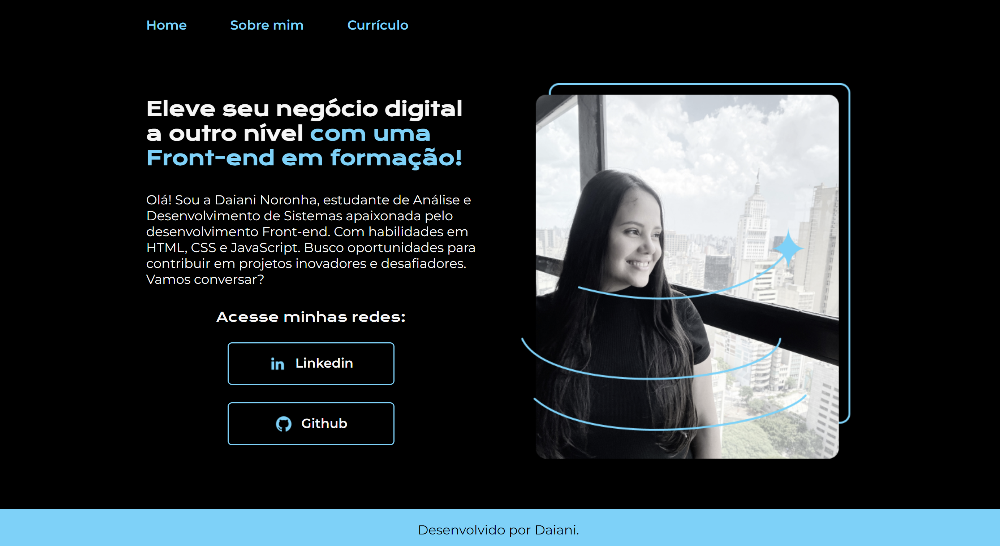

## 🖥️ Projeto
Este é um projeto web responsivo de um portifólio, desenvolvido na trilha HTML e CSS da Alura. Além da proposta inicial do projeto que continha duas páginas uma "Home" e outra "Sobre mim", adicionei uma terceira página chamada "Currículo" para conter informações adicionais. 

## 🚀 Tecnologias 
- HTML
- CSS
- Git e Github